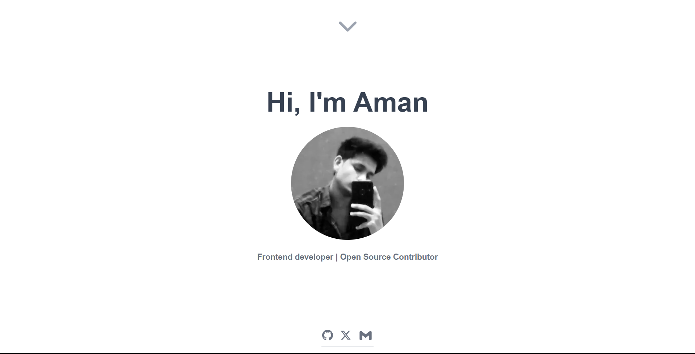
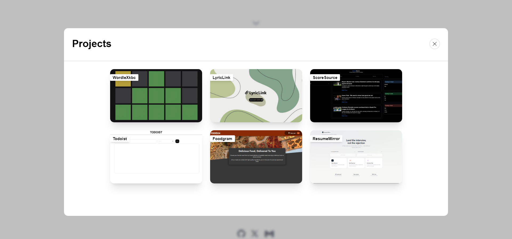

#  Portfolio Website

A modern, fully responsive developer portfolio built with **Next.js**, **TypeScript**, and **Tailwind CSS**. This project showcases my skills, projects, and experience with a focus on performance, accessibility, and clean UI/UX.

---

##  Live Demo

 https://amanxyz.vercel.app/

---

## Screenshots

 
 

##  Features

*  **Fast & Optimized** – Built with Next.js for SSR/SSG performance
*  **Modern UI** – Styled using Tailwind CSS with a clean design system
*  **Fully Responsive** – Works seamlessly across mobile, tablet, and desktop
*  **Type Safety** – Written in TypeScript for better scalability and reliability
*  **Reusable Components** – Modular and maintainable component structure
*  **Dark Mode Support** *(if implemented)*
*  **Project Showcase** – Highlighting real-world projects with details
*  **Contact Section** – Easy way to connect

---

##  Tech Stack

* **Framework:** Next.js
* **Language:** TypeScript
* **Styling:** Tailwind CSS
* **Deployment:** *(Vercel / Netlify / other)*

---

<<<<<<< Updated upstream
##  What I Learned
=======
## What I Learned
>>>>>>> Stashed changes

* Building scalable frontend architecture with Next.js
* Writing clean and maintainable TypeScript code
* Creating responsive UI using Tailwind CSS
* Optimizing performance and accessibility

